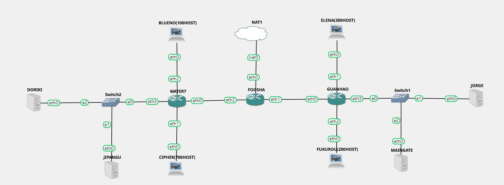
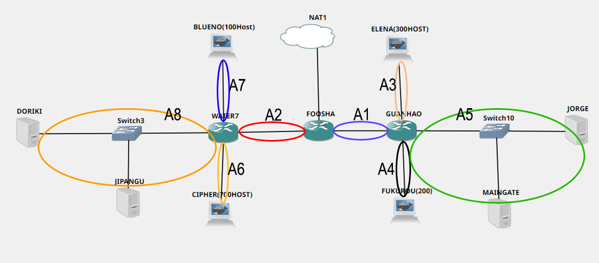

# Jarkom-Modul-5-T11-2021

Nama Anggota | NRP
------------------- | --------------		
Justin Alfonsius Sitanggang | 05311840000043
Daniel Evan | 05311940000016
Calvin Manuel | 05311940000049

## Soal A
Tugas pertama kalian yaitu membuat topologi jaringan sesuai dengan rancangan yang diberikan Luffy

### Jawaban
Berikut adalah topologi yang kami buat berdasarkan topologi yang ada pada soal
 

## Soal B
Karena kalian telah belajar subnetting dan routing, Luffy ingin meminta kalian untuk membuat topologi tersebut menggunakan teknik CIDR atau VLSM. setelah melakukan subnetting

### Jawaban
Pada soal shift kali ini kami menggunakan teknik VLSM untuk melakukan subnetting dan routing, berikut adalah pembagian subnet pada topologi
  

Total terdapat 8 buah subnet dengan 1314 total host, selanjutnya kami membuat pembagiannya menggunakan tree
  

## Soal C
Kalian juga diharuskan melakukan Routing agar setiap perangkat pada jaringan tersebut dapat terhubung.

### Jawaban

## Soal D
Tugas berikutnya adalah memberikan ip pada subnet Blueno, Cipher, Fukurou, dan Elena secara dinamis menggunakan bantuan DHCP server. Kemudian kalian ingat bahwa kalian harus setting DHCP Relay pada router yang menghubungkannya.

### Jawaban

## Soal 1
Agar topologi yang kalian buat dapat mengakses keluar, kalian diminta untuk mengkonfigurasi Foosha menggunakan iptables, tetapi Luffy tidak ingin menggunakan MASQUERADE.

### Jawaban

## Soal 2
Kalian diminta untuk mendrop semua akses HTTP dari luar Topologi kalian pada server yang merupakan DHCP Server dan DNS Server demi menjaga keamanan.

### Jawaban

## Soal 3
Karena kelompok kalian maksimal terdiri dari 3 orang. Luffy meminta kalian untuk membatasi DHCP dan DNS Server hanya boleh menerima maksimal 3 koneksi ICMP secara bersamaan menggunakan iptables, selebihnya didrop.

### Jawaban

## Soal 4
Akses dari subnet Blueno dan Cipher hanya diperbolehkan pada pukul 07.00 - 15.00 pada hari Senin sampai Kamis.

### Jawaban

## Soal 5
Akses dari subnet Elena dan Fukuro hanya diperbolehkan pada pukul 15.01 hingga pukul 06.59 setiap harinya. Selain itu di reject

### Jawaban

## Soal 6
Karena kita memiliki 2 Web Server, Luffy ingin Guanhao disetting sehingga setiap request dari client yang mengakses DNS Server akan didistribusikan secara bergantian pada Jorge dan Maingate

### Jawaban
